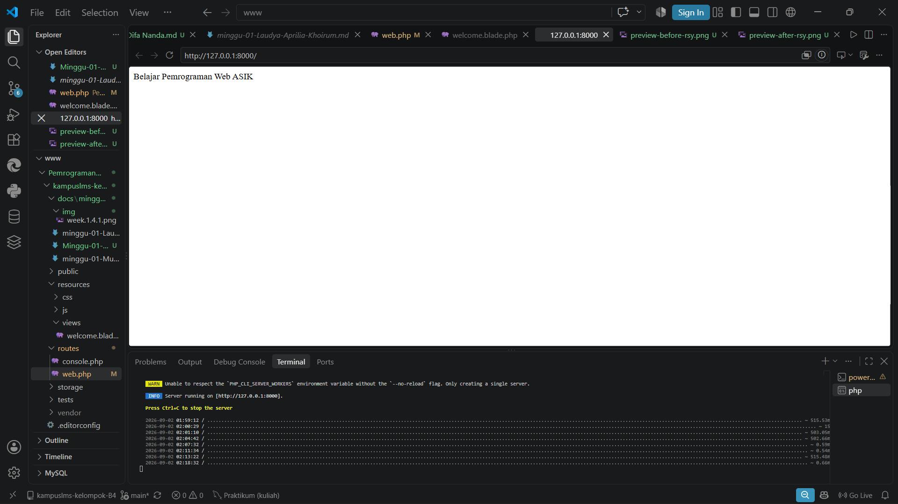
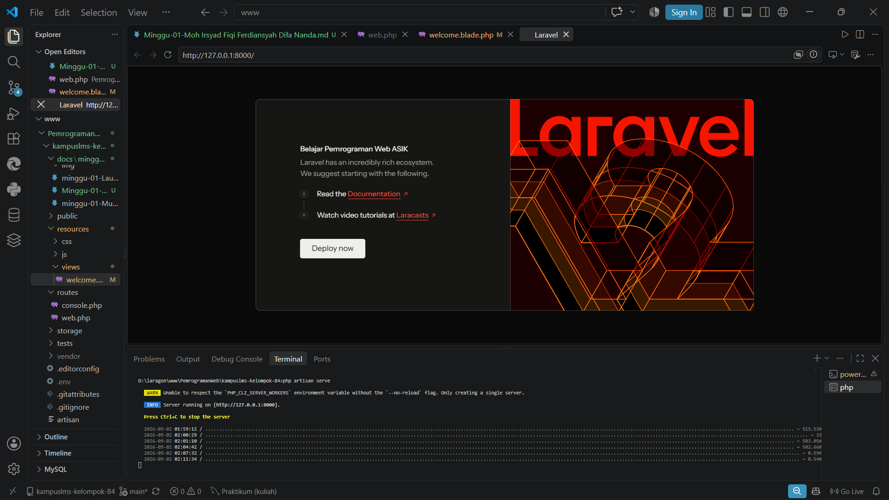
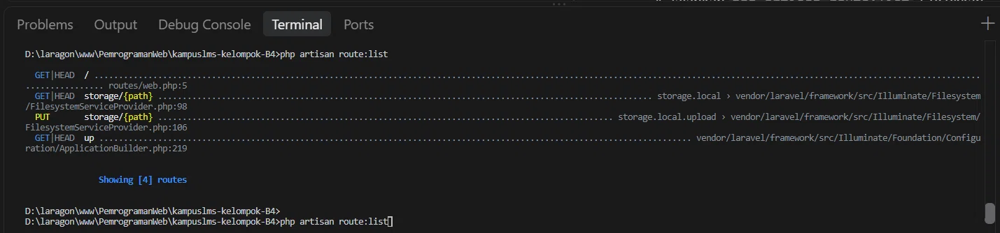

# 1.3 Read → Break → Fix → Build

### READ — Bedah instalasi Anda sendiri (45 menit)

Setelah instalasi selesai dan halaman selamat datang Laravel muncul, kerjakan **tanpa AI**:

1. Buka `public/index.php`. Baca dari atas ke bawah. Tulis dalam 3 kalimat apa yang dilakukan berkas ini.
2. Buka `bootstrap/app.php`. Identifikasi bagian mana yang mengurus route, mana yang mengurus middleware, mana yang mengurus exception.
3. Buka `routes/web.php`. Temukan route yang menghasilkan halaman selamat datang. Ubah teksnya, muat ulang browser, pastikan berubah.
4. Jalankan `php artisan route:list`. Cocokkan keluarannya dengan isi `routes/web.php`.

## Jawab
1. File `public/index.php` berfungsi sebagai pintu masuk (entry point) utama aplikasi Laravel yang menerima semua permintaan HTTP dari pengguna. File ini mendefinisikan konstanta LARAVEL_START untuk mencatat waktu mulai eksekusi, kemudian memeriksa apakah aplikasi sedang dalam mode pemeliharaan (maintenance) dengan mengecek file maintenance.php. Terakhir, file ini memuat autoloader Composer, bootstrap aplikasi dari bootstrap/app.php, dan menangani permintaan yang masuk melalui method handleRequest().

2. Identifikasi Bagian di `bootstrap/app.php`
```php
return Application::configure(basePath: dirname(__DIR__))
    ->withRouting(                              // <-- BAGIAN ROUTE
        web: __DIR__.'/../routes/web.php',
        commands: __DIR__.'/../routes/console.php',
        health: '/up',
    )
    ->withMiddleware(function (Middleware $middleware) {  // <-- BAGIAN MIDDLEWARE
        // 
    })
    ->withExceptions(function (Exceptions $exceptions) { // <-- BAGIAN EXCEPTION
        // 
    })->create();
```
- `->withRouting()` : Mengatur file routing untuk web, console, dan health check
- `->withMiddleware()` : Tempat mendaftarkan middleware global atau grup
- `->withExceptions()` : Tempat mengatur penanganan exception/custom error
3. Ubah Teks Welcome di `routes/web.php`
<br> Masuk ke file *web.php* pada folder routes cari baris `return view('welcome');` lalu ubah menjadi `return "Belajar Pemrograman Web ASIK";` untuk mengubah tampilan menjadi blank putih dengan teks *Belajar Pemrograman Web ASIK* seperti gambar berikut: 
<br> Jika ingin mengubah teks dengan tampilan template Laravel dapat diubah dengan masuk ke file *welcome.blade.php* cari bagian `<h1 class="mb-1 font-medium">Let's get started</h1>` ubah menjadi `<h1 class="mb-1 font-medium">Belajar Pemrograman Web ASIK</h1>` agar tampilannya seperti gambar berikut: 
4. Cocokan output `php artisan route:list` dengan `routes/web.php`
<br>  dari gambar diatas diperoleh kecocokan
- Route / → Cocok dengan routes/web.php baris 5, yaitu route Route::get('/') yang kita buat untuk halaman welcome.