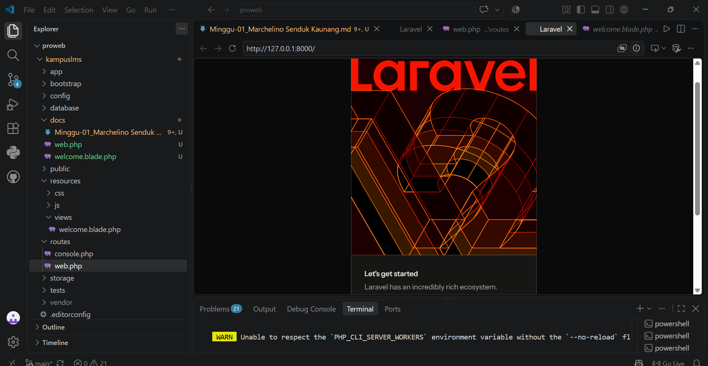
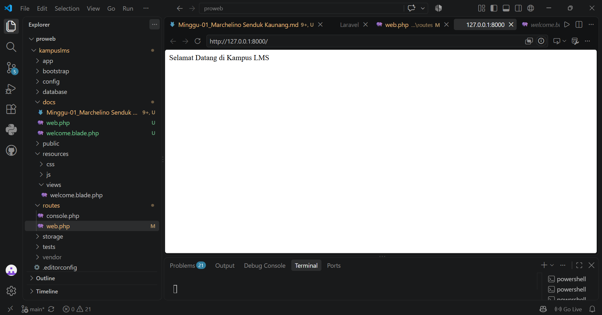
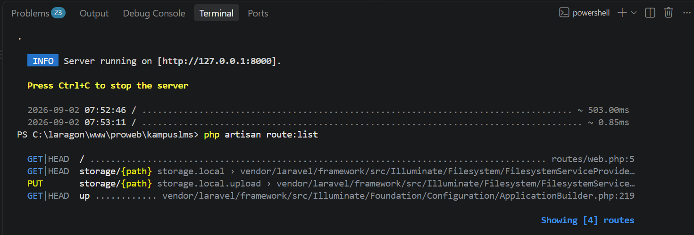

# 1.3 READ
### Nama : Marchelino Senduk Kaunang
### NIM  : 10241040
---

## 1. `public/index.php`
```php
<?php

use Illuminate\Foundation\Application;
use Illuminate\Http\Request;

define('LARAVEL_START', microtime(true));

// Determine if the application is in maintenance mode...
if (file_exists($maintenance = __DIR__.'/../storage/framework/maintenance.php')) {
    require $maintenance;
}

// Register the Composer autoloader...
require __DIR__.'/../vendor/autoload.php';

// Bootstrap Laravel and handle the request...
/** @var Application $app */
$app = require_once __DIR__.'/../bootstrap/app.php';

$app->handleRequest(Request::capture());
```

Jadi, `index.php` berfungsi sebagai gerbang awal aplikasi Laravel. File ini bukan tempat utama untuk membuat fitur aplikasi, tetapi bertugas menghubungkan request dari pengguna dengan sistem Laravel agar request tersebut dapat diproses dan menghasilkan response yang sesuai.
---

## 2. Buka `bootstrap/app.php`. Identifikasi bagian mana yang mengurus route, mana yang mengurus middleware, mana yang mengurus exception.
```php
<?php

use Illuminate\Foundation\Application;
use Illuminate\Foundation\Configuration\Exceptions;
use Illuminate\Foundation\Configuration\Middleware;

return Application::configure(basePath: dirname(__DIR__))
    ->withRouting(
        web: __DIR__.'/../routes/web.php',
        commands: __DIR__.'/../routes/console.php',
        health: '/up',
    )
    ->withMiddleware(function (Middleware $middleware) {
        //
    })
    ->withExceptions(function (Exceptions $exceptions) {
        //
    })->create();
```

Pada file `bootstrap/app.php`, terdapat beberapa bagian yang memiliki fungsi berbeda. Bagian withRouting() digunakan untuk mengatur route, yaitu menentukan file dan alamat yang digunakan ketika pengguna mengakses aplikasi. Bagian `withMiddleware()` digunakan untuk mengatur middleware, yang berfungsi sebagai penyaring atau perantara sebelum request diproses oleh aplikasi. Sedangkan bagian `withExceptions()` digunakan untuk mengatur exception, yaitu bagaimana aplikasi menangani kesalahan atau error yang terjadi saat program dijalankan. Jadi, dari kode tersebut dapat diketahui bahwa `withRouting()` mengatur route, `withMiddleware()` mengatur middleware, dan `withExceptions()` mengatur error atau exception pada aplikasi.

---

## 3.  Buka `routes/web.php`. Temukan route yang menghasilkan halaman selamat datang. Ubah teksnya, muat ulang browser, pastikan berubah.

Route bawaan yang menghasilkan selamat datang dibagian

```php
<?php

use Illuminate\Support\Facades\Route;

Route::get('/', function () {
    return view('welcome');
});

```
Kode tersebut digunakan untuk mengatur halaman utama pada aplikasi Laravel. `Route::get('/') ` berarti Laravel akan menjalankan kode tersebut ketika pengguna mengakses alamat utama website atau tanda /. Setelah itu, `function ()` menjalankan perintah untuk menampilkan halaman, yaitu return view('welcome'). Artinya, ketika pengguna membuka halaman utama aplikasi, Laravel akan menampilkan file view welcome.blade.php yang biasanya berada di dalam folder resources/views. Jadi, fungsi route tersebut adalah menghubungkan alamat utama website (/) dengan halaman welcome yang akan ditampilkan kepada pengguna.

teks sebelum diubah 


dan setelah diganti pada pada bagian return `view('welcome')` "menjadi selamat datang di Kampus LMS" Jadilah seperti pada gambar di bawah ini



---

## 4. Jalankan `php artisan route:list`. Cocokkan keluarannya dengan isi `routes/web.php`.


Bagian ini merupakan kode untuk melihat daftar route yang ada pada laravel dan memiliki hasil 




karena route yang ada di nomor 3 terlihat pada hasil `php artisan route:list` menunjukkan route `/` yang terdapat pada `web.php` terdaftar dan dikenali oleh laravel.

yang berarti `web.php` memiliki kecocokan yang berhasil dikenali oleh laravel dan sesuai dengan isi `routes/web.php`