# Tugas 1 – Pemrograman Web
**Nama:** Laudya Aprilia Khoirum  
**NIM:** 10241038  
**Program Studi:** Sistem Informasi  

---

## 1. Buka `public/index.php.` Baca dari atas ke bawah. Tulis dalam 3 kalimat apa yang dilakukan berkas ini.

Jawaban: 

- Berkas ini mencatat waktu mulai eksekusi aplikasi dan memeriksa apakah sistem sedang dalam mode pemeliharaan (maintenance mode).
  
    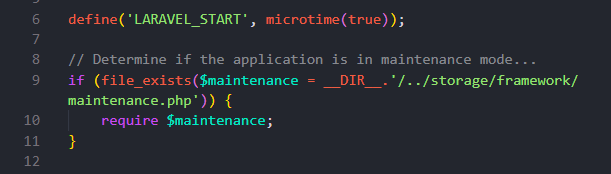

- Selanjutnya, berkas memuat autoloader Composer untuk mengimpor seluruh dependensi serta menginisialisasi pustaka bootstrap aplikasi Laravel.
  
    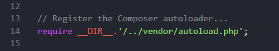

- Terakhir, berkas menangkap request HTTP yang masuk dari pengguna dan memprosesnya untuk mengembalikan respons web.
  
    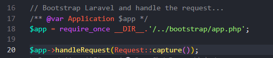
 
---

## 2. Buka `bootstrap/app.php`. Identifikasi bagian mana yang mengurus route, mana yang mengurus middleware, mana yang mengurus exception.

Jawaban:

- Routing: Ditangani oleh metode ->withRouting(...), di mana rute-rute aplikasi (seperti web.php dan console.php) didaftarkan.
  
    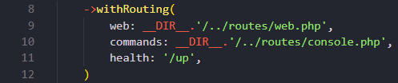

- Middleware: Ditangani oleh metode ->withMiddleware(function (Middleware $middleware) { ... }), tempat kita dapat mengonfigurasi atau menambahkan middleware global/kelompok.
  
    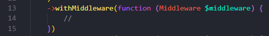

- Exception: Ditangani oleh metode ->withExceptions(function (Exceptions $exceptions) { ... }), tempat pengaturan penanganan error dan exception kustom dilakukan.
  
    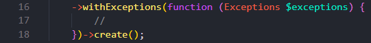

---

## 3. Buka `routes/web.php`. Temukan route yang menghasilkan halaman selamat datang. Ubah teksnya, muat ulang browser, pastikan berubah.

Jawaban:

- Jadi ketika `routes/web.php` baru dibuka isinya seperti ini, terlihat bahwa terdapat bagian `view('welcome')`

    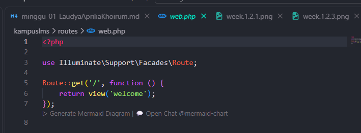

- Pada tulisan `view('welcome')` tersebut kita ubah menjadi tulisan "Halo semuanya, saya laudya dan saya suka boneka"

    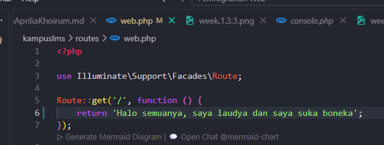

- Setelah itu dapat kita refresh halaman chrome kita dan tampilannya akan berubah jadi plain seperti ini

    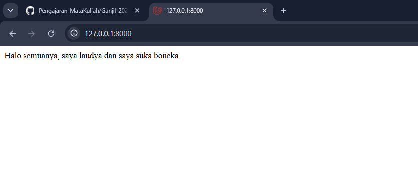

- Ada lagi jika kita buka laman asli dashboard laravel kita akan ditemukan oleh tampilan seperti dibawah

    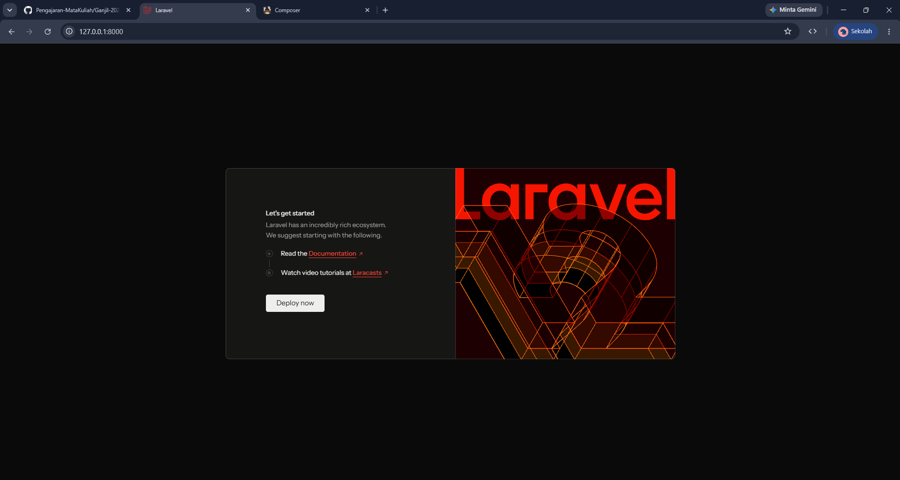

- Tulisan "Let's get started" dapat kita ubah jika kita buka `resources/view/welcome.blade.php`.

    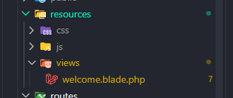

- Ini adalah halaman yang di panggil oleh `view('welcome')` di `routes/web.php`
    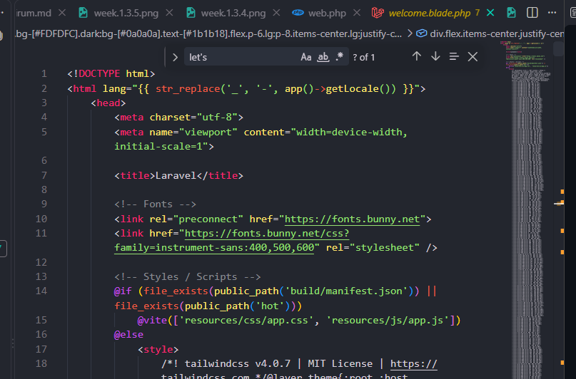

- Sehingga jika kita cari kalimat "Let's get started" dan menggantinya dengan kalimat lain maka tulisannya juga akan berubah
    
    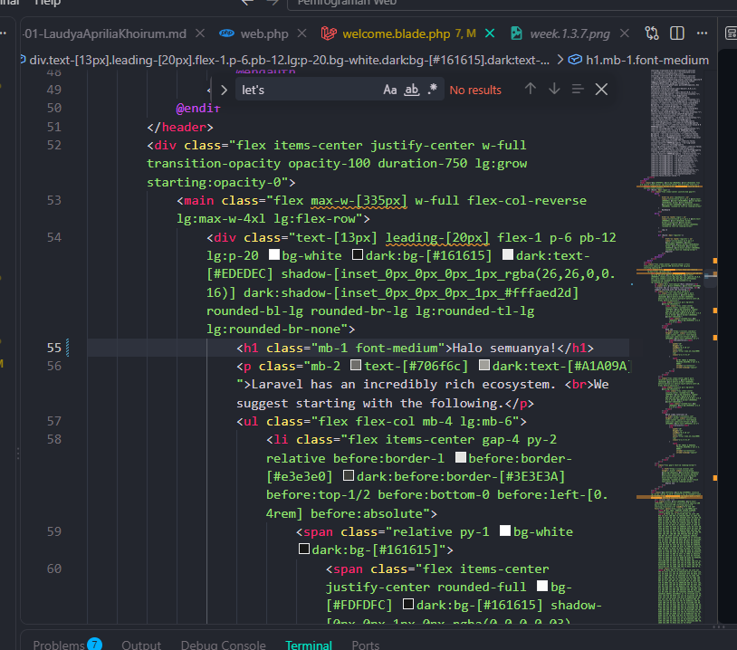

    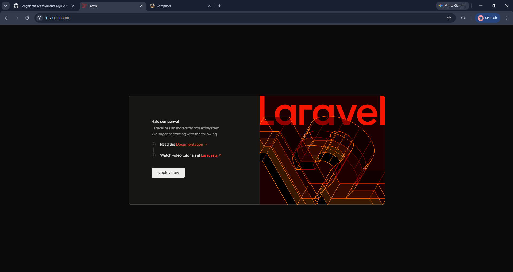

---

## 4. Jalankan `php artisan route:list`. Cocokkan keluarannya dengan isi `routes/web.php`.

Jawaban:

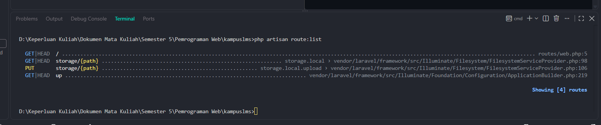
- Di dalam terminal saya lihat lihat tabel rute.
- Pada baris dengan Method: GET | HEAD paling pertama terdapat definisi Route::get('/', ...) yang ada pada berkas routes/web.php.