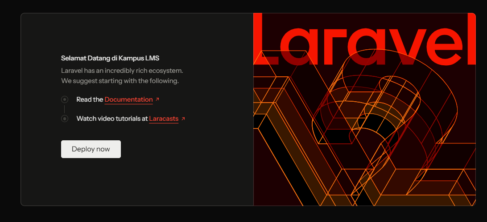

# Jawaban 1.3 READ
### Nama : Muhammad Arif Saputra
### NIM  : 10241044  
---

## 1. `public/index.php`

Berkas tersebut berfungsi sebagai jalan masuk yang menerima semua request yang masuk dari browser pengguna. Selanjutnya file `index.php` memanggil laravel melalui `bootstrap/app.php`. lalu memproses routing dan mengirim balik ke browser.

---

## 2. `bootstrap/app.php`

Bagian yang mengurus route di bagian `withRouting(...)`  
Bagian yang mengurus Middleware di bagian `withMiddleware(function (Middleware $middleware) {})`  
Bagian yang mengurus exceptions di bagian `withExceptions(function (Exceptions $exceptions) {...})`

---

## 3. `routes/web.php`

Route bawaan yang menghasilkan selamat datang dibagian

```php
Route::get('/', function () {
    return view('welcome');
});
```
route diatas berfungsi untuk mengatur halaman yang ditampilkan  yaitu halaman welcome yang mengarah ke resource\view\welcome.blade.php
Dan jika ingin mengubah teks nya karena waktu dijalankan di browser yang ditampilkan itu merupakan halaman welcome.blade.php 

teks sebelum diubah di welcome.blade.php


dan setelah diganti pada file welcome.blade.php pada bagian "Let's get started" "menjadi selamat datang di Kampus LMS" Jadilah seperti pada gambar di bawah ini



---

## 4. `php artisan route:list`

Bagian ini merupakan kode untuk melihat daftar route yang ada pada laravel dan memiliki hasil 
```
  GET|HEAD  / ....................................................................................................................................................... routes/web.php:5
  GET|HEAD  storage/{path} ....................................................... storage.local › vendor/laravel/framework/src/Illuminate/Filesystem/FilesystemServiceProvider.php:98
  PUT       storage/{path} ............................................... storage.local.upload › vendor/laravel/framework/src/Illuminate/Filesystem/FilesystemServiceProvider.php:106
  GET|HEAD  up ........................................................................... vendor/laravel/framework/src/Illuminate/Foundation/Configuration/ApplicationBuilder.php:219

                                                                                                                                                                    Showing [4] routes
```

karena diminta untuk mencocokkan dengan route yang ada di nomor 3 terlihat pada hasil `php artisan route:list` menunjukkan route `/` yang terdapat pada `web.php` terdaftar dan dikenali oleh laravel.

yang berarti `web.php` memiliki kecocokan yang berhasil dikenali oleh laravel.  


----

# BREAK

| # | Yang dirusak | Prediksi Anda sebelum mencoba | Pesan error sebenarnya |
|---|--------------|-------------------------------|------------------------|
| 1 | Ganti nama `.env` menjadi `.env.bak` | Kemungkinan besar bakalan mengalami eror karena laravel ga bisa membaca konfig yang ada di `env` | menampilkan pesan error 500 Server Error |
| 2 | Kosongkan nilai `APP_KEY` di `.env` | kemungkinan terjadi error yang menampilkan bahwa laravel membutuhkan kredensial key dari `APP_KEY` tersebut | No Application encryption key has been specified |
| 3 | Ubah `DB_DATABASE` menjadi nama yang tidak ada | bakal terjadi error yang menunjukkan tidak ada path untuk ke database | Database file at path [lara] does not exist. |
| 4 | Ubah `APP_DEBUG=false`, lalu ulangi nomor 3 | perbedaan dengan nomor 3 tadi yaitu error tetap ada namun tidak ditampilkan dan laravel tetap berjalan | Menampilkan halaman depan laravel |