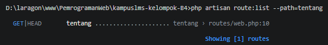

## 2.3 Read → Break → Fix → Build

### READ — Telusuri satu request penuh (30 menit)

Ambil route `/tentang` yang Anda buat minggu lalu. Tanpa AI, tulis di catatan Anda:

1. Baris mana di `routes/web.php` yang menangkapnya?
2. Kalau ditangani controller, berkas dan method mana?
3. View mana yang dikembalikan? Di path apa persisnya?
4. Layout apa yang membungkusnya?
5. Jalankan `php artisan route:list --path=tentang`. Cocok dengan analisis Anda?

## Jawab
1. Ketika /tentang dijalankan, maka laravel akan mengeksekusi baris kode berikut:
```php
Route::get('/tentang', function () {
    return view('tentang');
})->name('tentang');
```

2. Untuk route /tentang belum menggunakan controller, karena menggunakan Closure/function menggunakan method GET

3. View yang dikembalikan adalah `return view('tentang');` sehingga laravel akan mengakses path `resources/views/tentang.blade.php`

4. Dibungkus oleh `layout.blade.php` karena dalam file `tentang.blade.php` hanya berisi kode html 

5. Hasil dari `php artisan route:list --path=tentang` adalah 
gambar tersebut menampilkan bahwa route /tentang telah terdaftar dan dapat dibaca oleh laravel dengan benar