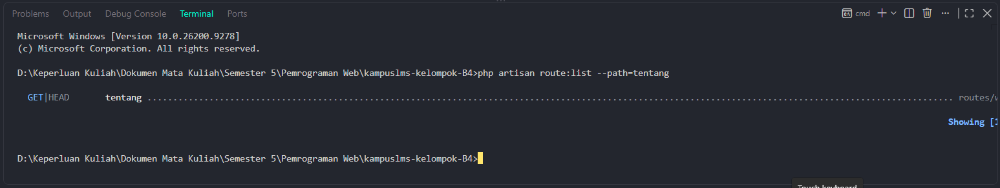

# Tugas 2 – Pemrograman Web
**Nama:** Laudya Aprilia Khoirum  
**NIM:** 10241038  
**Program Studi:** Sistem Informasi  

---

## 1. Baris mana di `routes/web.php` yang menangkapnya?

Jawaban: 
Baris `routes/web.php` yang menangkap request untuk `/tentang` ditangkap pada baris 10 hingga 12 yang akan mengarahkan dan menampilkan tabel anggota
```
Route::get('/tentang', function () {
    return view('tentang');
})->name('tentang');
```

---

## 2. Kalau ditangani controller, berkas dan method mana?

Jawaban:
Route `/tentang` saat ini tidak diampu oleh berkas controller. Request ditangani langsung menggunakan fungsi Closure (fungsi tanpa nama) yang mengembalikan tampilan Blade.

---

## 3. View mana yang dikembalikan? Di path apa persisnya?

Jawaban:
View yang dikembalikan adalah `resources/views/tentang.blade.php` yang berisi tabel informasi anggota dalam bentuk html biasa.

---

## 4. Layout apa yang membungkusnya?

Jawaban:
View `tentang.blade.php` belum memakai/dibungkus oleh layout apa pun. Berkas tersebut masih berupa struktur HTML polos mandiri (menggunakan tag `<html>`, `<head>`, dan `<body>` bawaan) tanpa adanya panggilan komponen layout seperti `<x-layout>`.

---

## 5. Jalankan `php artisan route:list --path=tentang`. Cocok dengan analisis Anda?

Jawaban:
Perintah `php artisan route:list --path=tentang` berfungsi untuk menampilkan daftar route yang jalurnya cocok dengan `tentang` yaitu `GET|HEAD...routes/web.php`


