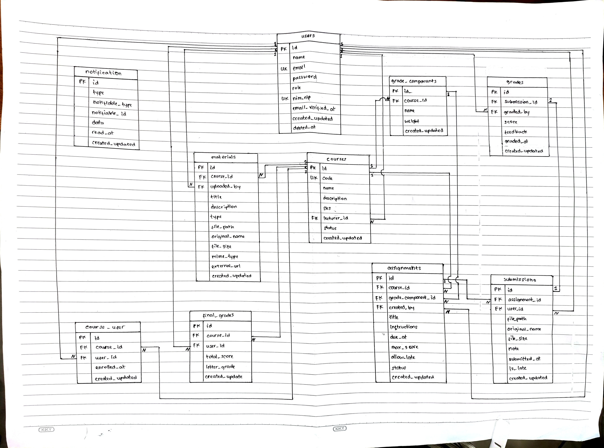

# READ
## Anggota : 
Laudya Aprillia Khoirum (10241038),   
Marchelino Senduk Kaunang (10241040),   
Moh. Irsyad Fiqi Ferdiansyah Difa Nanda (10241042),   
Muhammad Arif Saputra (10241044)

### 1. Gambar ulang ERD dari spesifikasi di papan/kertas, tanpa melihat dokumen.

### 2. Untuk setiap foreign key, tentukan perilaku onDelete-nya dan tuliskan alasannya.

| FK                               | `onDelete`           | Alasan singkat                                 |
| -------------------------------- | -------------------- | ---------------------------------------------- |
| `courses.lecturer_id`            | **RESTRICT**         | Course tidak boleh hilang karena dosen dihapus |
| `course_user.course_id`          | **CASCADE**          | Enrollment course ikut dibersihkan             |
| `course_user.user_id`            | **CASCADE**          | Enrollment user ikut dibersihkan               |
| `materials.course_id`            | **CASCADE**          | Material bergantung pada course                |
| `assignments.course_id`          | **CASCADE**          | Assignment bergantung pada course              |
| `assignments.grade_component_id` | **CASCADE**          | Assignment bergantung pada komponen nilai      |
| `assignments.created_by`         | **sesuai migration** | Referensi pembuat assignment                   |
| `submissions.assignment_id`      | **CASCADE**          | Submission bergantung pada assignment          |
| `submissions.user_id`            | **CASCADE**          | Submission milik user                          |
| `grades.submission_id`           | **CASCADE**          | Grade bergantung pada submission               |
| `grades.graded_by`               | **sesuai migration** | Referensi pemberi nilai                        |

### 3. Jawab: kalau seorang dosen dihapus, apa yang terjadi pada mata kuliahnya? Kenapa dirancang begitu?

Kalau seorang dosen dihapus, mata kuliah yang dia ampu tidak ikut terhapus. Penghapusan dosen akan ditolak oleh database apabila dosen tersebut masih menjadi lecturer pada suatu mata kuliah.   

#### Kenapa dirancang begitu?
Karena mata kuliah merupakan data akademik yang tetap penting, walaupun dosen yang mengampunya sudah tidak ada. Kalau kita menggunakan CASCADE, menghapus dosen bisa menyebabkan semua mata kuliah yang dia ampu ikut terhapus.

### 4. Jawab: kenapa grades.submission_id bersifat unique, bukan sekadar index biasa?

grades.submission_id bersifat unique karena satu submission hanya boleh memiliki satu nilai (grade). Jika hanya menggunakan index biasa, satu submission masih bisa memiliki beberapa grade. Dengan unique constraint, database dapat mencegah duplikasi grade dan menjaga integritas data sesuai relasi Submission yang memiliki satu Grade.