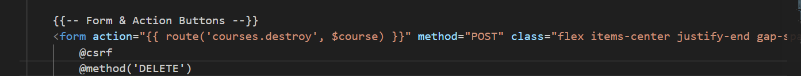
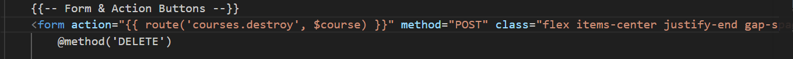
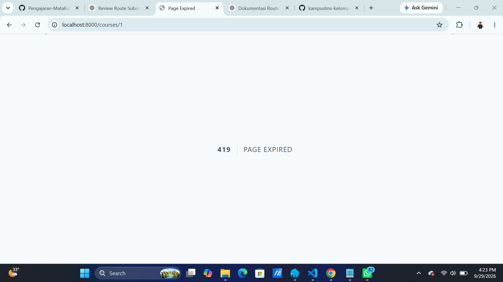
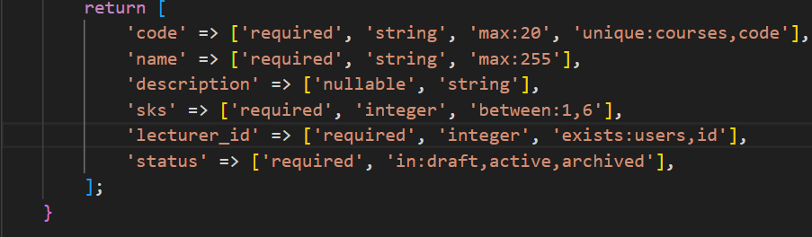
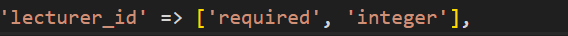
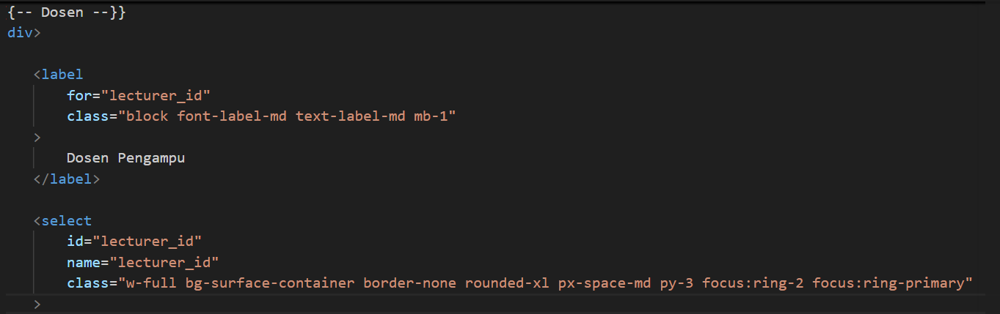
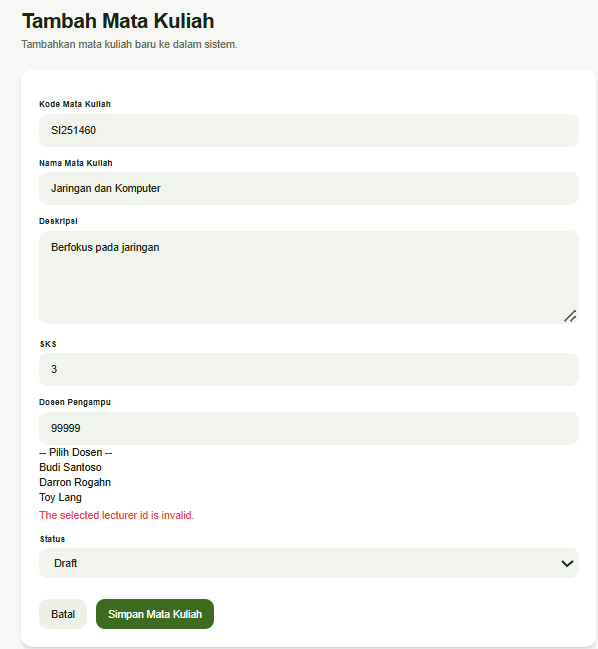
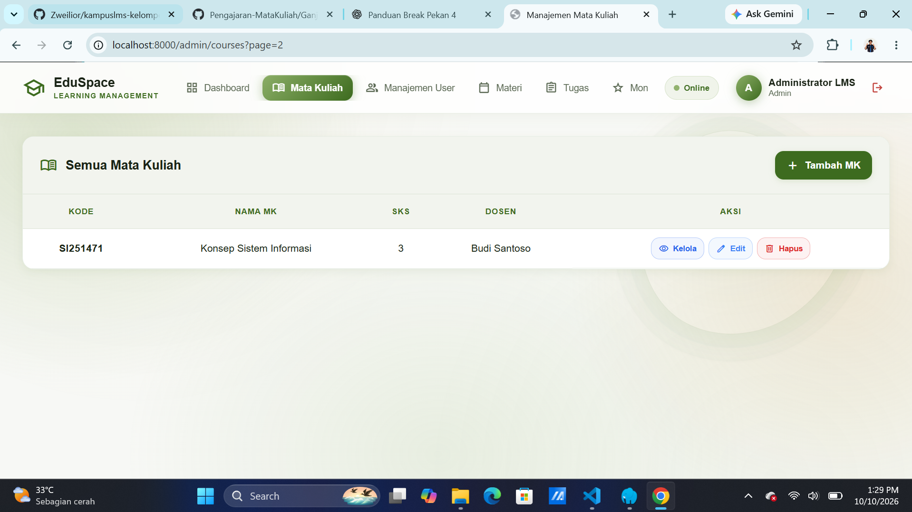

#  4.3 Read → Break → Fix → Build
#### Nama : Marchelino Senduk Kaunang
#### NIM : 10241040

#### 4.3 Break

| # | Yang dirusak | Yang harus Anda amati |
|---|--------------|------------------------|
| 1 | Hapus `@csrf` dari form, lalu kirim | Error 419 — dan renungkan apa yang dicegahnya |
| 2 | Ganti `$request->validated()` menjadi `$request->all()`, lalu kirim field liar lewat `curl` | Mass assignment kembali terbuka |
| 3 | Hapus validasi `exists:users,id` pada `lecturer_id`, kirim `lecturer_id=99999` | Data yatim masuk database |
| 4 | Hapus validasi `in:...` pada `status`, kirim `status=superadmin` | Enum jebol |
| 5 | Hapus `->withQueryString()`, lakukan pencarian lalu klik halaman 2 | Filter hilang — bug klasik |
| 6 | Ganti `return redirect()` menjadi `return view()` pada `store`, lalu tekan F5 setelah simpan | Data ganda; ini alasan PRG ada |
| 7 | Hapus `old(...)` dari semua input, lalu kirim form dengan satu kesalahan | Rasakan sendiri sebagai pengguna |

Jawab : 
##### 1. Pengujian CSRF

Pada percobaan pertama, `@csrf` dihapus dari form penghapusan course, sedangkan `@method('DELETE')` tetap dipertahankan. Buka file `show.blade.php`, lalu cari 

```php
{{-- Form & Action Buttons --}}
    <form action="{{ route('courses.destroy', $course) }}" method="POST" class="flex items-center justify-end gap-space-sm pt-space-sm border-t border-outline/10">
        @csrf
        @method('DELETE')
```



Lalu hapus `@csrf` :



Untuk hasil :



Setelah tombol Hapus ditekan, Laravel menampilkan:

`419 PAGE EXPIRED`

Hal tersebut terjadi karena request tidak membawa token CSRF yang diperlukan Laravel untuk memvalidasi request yang mengubah data. Request akhirnya ditolak sehingga proses penghapusan course tidak dijalankan.

**Hasil:** Error 419 Page Expired.

**Kesimpulan:** CSRF token diperlukan pada form yang melakukan perubahan data. Jika token tidak dikirim atau tidak valid, Laravel akan menolak request tersebut.

##### 2. Mass Assignment — validated() menjadi all()

`validated()` hanya mengambil data yang lolos validasi, sedangkan all() mengambil semua input pengguna. Penggunaan all() berisiko memasukkan data yang tidak seharusnya diproses.

Yang diubah pada file :

`app/Http/Controllers/CourseController.php`

Cari file :

`$data = $request->validated();`

Ubah menjadi :

`$data = $request->all();`

Data yang tidak termasuk data validasi bisa ikut masuk ke $data.
Namun perlu diperhatikan: kalau model masih memiliki $fillable yang benar, Laravel tetap dapat menolak field tersebut. Jadi BREAK ini menunjukkan bahwa `$request->all()` membuka pintu lebih lebar, bukan otomatis berarti semua field pasti masuk database.

##### 3. Hapus exists:users,id

Pertama kita buka klik file : `app/http/controllers/requests/StoreCourseRequests.php`

Lalu cari :



Hapus bagian `exists:users,id`:



Setelah kita menghapus `exists:users,id` pada `StoreCourseRequests.php` cari file `lecture_id`. Klik `resources/view/courses/create.blade.php` :



Lalu kita ubah <select> menjadi <input> :

```php
<select
    id="lecturer_id"
    name="lecturer_id"
    class="w-full bg-surface-container border-none rounded-xl px-space-md py-3 focus:ring-2 focus:ring-primary"
>
```

diganti menjadi :

```php
<input
    type="number"
    id="lecturer_id"
    name="lecturer_id"
    value="99999"
    class="w-full bg-surface-container border-none rounded-xl px-space-md py-3 focus:ring-2 focus:ring-primary"
>
```

Lalu kita akan mencoba testing dengan manambahkan mata kuliah baru 



Pada pengujian ini dicoba memasukkan lecturer_id = 99999, yaitu ID dosen yang tidak terdaftar pada tabel users. Setelah form dikirim, sistem tidak mengizinkan data tersebut untuk disimpan dan menampilkan pesan:

`The selected lecturer id is invalid.`

Hasil tersebut menunjukkan bahwa sistem masih melakukan pengecekan terhadap lecturer_id dan memastikan ID dosen yang dimasukkan harus merupakan ID yang valid/terdaftar. Karena 99999 tidak ditemukan sebagai ID user, data mata kuliah tidak dapat disimpan.

##### 4. Hapus validasi `in` pada `status`

Validasi `in`: memastikan nilai status hanya berasal dari pilihan yang sudah ditentukan aplikasi. Tanpa validasi tersebut, nilai yang tidak sesuai aturan bisa diterima. Status course hanya boleh memiliki nilai tertentu, misalnya: 

- draft
- active
- archived

Validasi `in`:draft,active,archived membatasi status pada tiga pilihan yang diperbolehkan. Jika dihapus, nilai seperti superadmin bisa lolos dari validasi tersebut.

##### 5. Menghapus withQueryString()

Fungsi ini mempertahankan parameter pencarian dan filter saat berpindah halaman. Jika dihapus, pencarian atau filter bisa hilang ketika pengguna membuka halaman berikutnya.

Buka file:

`app/Http/Controllers/CourseController.php`

Cari method index(), lalu temukan kode berikut:

```php
$courses = $query
    ->orderBy('code')
    ->paginate(15)
    ->withQueryString();
```

Karena pada project ini belum ada fitur pencarian, jadi hasilnya seperti ini :


dilakukan dengan menghapus withQueryString() pada pagination. Akibatnya, parameter pencarian dan filter tidak otomatis diteruskan ke halaman berikutnya. Hal ini dapat membuat hasil yang ditampilkan tidak sesuai dengan pencarian sebelumnya. Setelah pengujian, withQueryString() dikembalikan agar fitur pagination bekerja seperti semula.

##### 6. Mengganti redirect() dengan view()

Buka:

`app/Http/Controllers/CourseController.php`

Cari method store() yang berfungsi menyimpan mata kuliah baru.

```php
$course = Course::create($data);

return redirect()
    ->route($this->routePrefix() . '.show', $course)
    ->with('success', 'Mata kuliah berhasil ditambahkan.');
```

Ubah menjadi :

```php
$course = Course::create($data);

return view('admin.courses.show', [
    'course' => $course,
    'lecturers' => User::where('role', 'dosen')
        ->orderBy('name')
        ->get(),
]);
```

Dilakukan dengan mengganti `redirect()` menjadi `view()` setelah penyimpanan data. Akibatnya, browser tetap berada pada respons POST sehingga refresh dapat memicu pengiriman ulang formulir dan berisiko membuat data duplikat. Penggunaan redirect kembali diterapkan agar alur penyimpanan lebih aman.

##### 7. Menghapus old() pada form

Cari file Blade untuk form tambah mata kuliah, biasanya:

`resources/views/admin/courses/create.blade.php`

Cari kode :

```php
<input type="text" name="code"
    value="{{ old('code') }}">
```

Hapus old('code') sehingga menjadi:

<input type="text" name="code" value="">

BREAK No. 7 dilakukan dengan menghapus fungsi old() pada input form. Akibatnya, nilai yang sebelumnya dimasukkan pengguna tidak ditampilkan kembali setelah validasi gagal. Setelah pengujian, fungsi old() dikembalikan agar pengguna tidak perlu mengisi ulang data dari awal.

##### 8. Menghapus pengelompokan where(function...)

Buka:

`app/Http/Controllers/CourseController.php`

Cari bagian pencarian di method index():

```php
if ($request->filled('search')) {
    $search = $request->input('search');

    $query->where(function ($q) use ($search) {
        $q->where('code', 'like', "%{$search}%")
            ->orWhere('name', 'like', "%{$search}%");
    });
}
```

Ubah menjadi :

```php
if ($request->filled('search')) {
    $search = $request->input('search');

    $query->where('code', 'like', "%{$search}%")
        ->orWhere('name', 'like', "%{$search}%");
}
```

BREAK No. 8 dilakukan dengan menghapus pengelompokan kondisi pencarian menggunakan `where(function...)`. Akibatnya, kombinasi pencarian dan filter status berpotensi menghasilkan data yang tidak sesuai. Pengelompokan dikembalikan agar kondisi pencarian dan filter diproses dengan benar.


