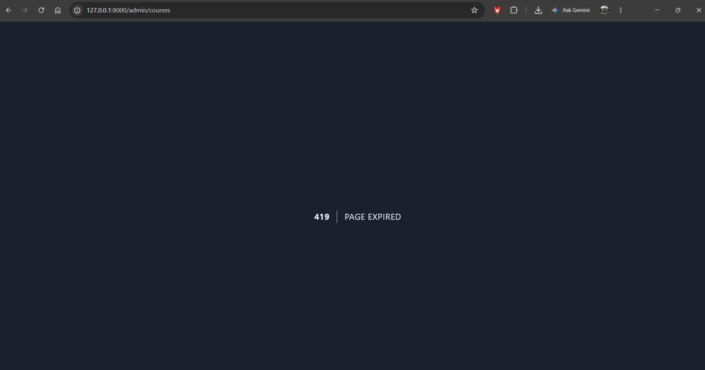

# BREAK
## Nama : Muhammad Arif Saputra
## NIM : 10241044

---

### 1. apa yang terjadi jika csrf dihapus di form dan apa yang dicegah nya
dia bakal terjadi error 419 page expired ketika kita klik submit nya tersebut

apa yang dicegah nya??  
Proteksi ini mencegah serangan CSRF (Cross-Site Request Forgery), yaitu serangan ketika situs jahat memanfaatkan browser pengguna yang sedang login untuk mengirim request ke aplikasi tanpa sepengetahuan pengguna. Karena browser otomatis menyertakan cookie session, server bisa mengira request tersebut sah. Token CSRF mencegah hal ini karena bersifat acak, tersimpan di session, dan hanya ada pada form yang ditampilkan oleh aplikasi itu sendiri, sehingga tidak bisa ditiru oleh situs lain. Hal ini penting pada aplikasi LMS yang memuat aksi sensitif, seperti input nilai, pengumpulan tugas, dan perubahan data akun.

## Break Nomor 2: Mass Assignment / Bypassed Validation

**Prediksi:** 
Jika validasi dihapus atau menggunakan `$request->all()`, field yang seharusnya dibatasi (seperti `sks` maksimal 6) bisa diisi dengan nilai liar (misalnya 99).

**Yang dirusak:** 
Mengubah validasi di `StoreCourseRequest` (atau menggunakan `$request->all()` di controller) sehingga batasan `max:6` pada field `sks` tidak lagi diterapkan.

**Eksekusi via curl:**
Mengirim payload dengan `sks=99` melalui POST request.
```bash
curl -X POST http://127.0.0.1:8000/admin/courses -H "Content-Type: application/x-www-form-urlencoded" -H "X-CSRF-TOKEN: <token>" -b "laravel_session=<session>" -d "code=HACK05" -d "name=Mata Kuliah SKS Gila" -d "sks=99" -d "lecturer_id=1" -d "status=active"
```

**Hasil Pengamatan:**
HTTP Status Code: 302 (Redirect berhasil, tidak ada error 500).
Cek Database (Tinker): Data dengan code HACK05 berhasil masuk. Kolom sks bernilai 99.
```
> App\Models\Course::where('code', 'HACK05')->first();                                                                                                                   

= App\Models\Course {#8639
    id: 8,
    code: "HACK05",
    name: "Mata Kuliah SKS Gila",
    description: "",
    sks: 99,
    lecturer_id: 1,
    status: "active",
    created_at: "2026-10-08 03:05:18",
    updated_at: "2026-10-08 03:05:18",
  }
```
**Kesimpulan:**
Tanpa validasi yang ketat ($request->validated()), aplikasi rentan terhadap input data yang tidak masuk akal atau berbahaya (Mass Assignment). $request->all() menerima SEMUA input dari user, termasuk field yang dimanipulasi.