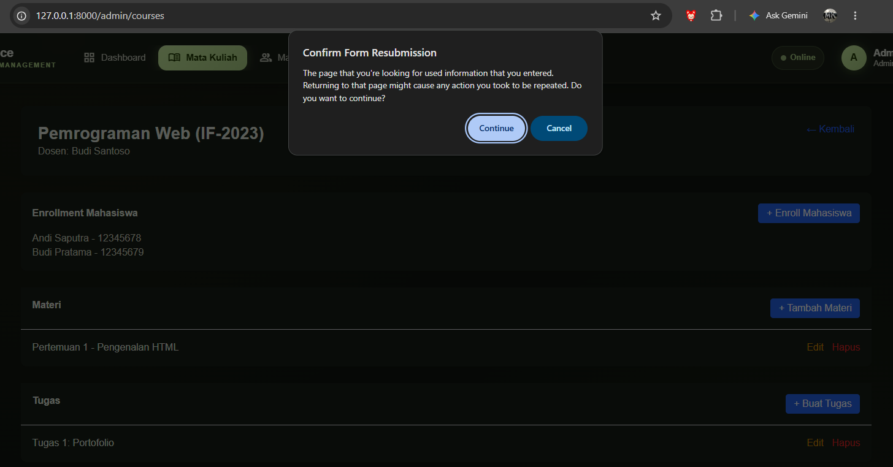
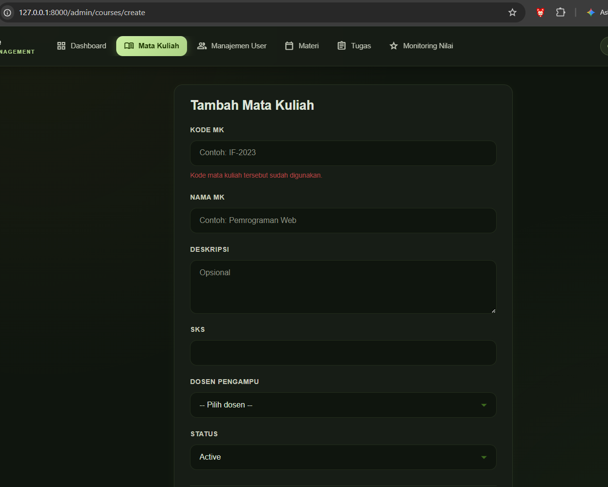
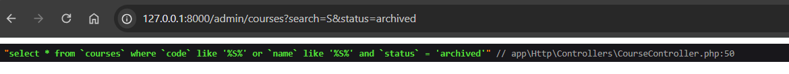

# BREAK
## Nama : Muhammad Arif Saputra
## NIM : 10241044

---

### 1. apa yang terjadi jika csrf dihapus di form dan apa yang dicegah nya
dia bakal terjadi error 419 page expired ketika kita klik submit nya tersebut

apa yang dicegah nya??  
Proteksi ini mencegah serangan CSRF (Cross-Site Request Forgery), yaitu serangan ketika situs jahat memanfaatkan browser pengguna yang sedang login untuk mengirim request ke aplikasi tanpa sepengetahuan pengguna. Karena browser otomatis menyertakan cookie session, server bisa mengira request tersebut sah. Token CSRF mencegah hal ini karena bersifat acak, tersimpan di session, dan hanya ada pada form yang ditampilkan oleh aplikasi itu sendiri, sehingga tidak bisa ditiru oleh situs lain. Hal ini penting pada aplikasi LMS yang memuat aksi sensitif, seperti input nilai, pengumpulan tugas, dan perubahan data akun.

## 2. Mass Assignment / Bypassed Validation

**Prediksi:** 
Jika validasi dihapus atau menggunakan `$request->all()`, field yang seharusnya dibatasi (seperti `sks` maksimal 6) bisa diisi dengan nilai liar (misalnya 99).

**Yang dirusak:** 
Mengubah validasi di `StoreCourseRequest` (atau menggunakan `$request->all()` di controller) sehingga batasan `max:6` pada field `sks` tidak lagi diterapkan.

**Eksekusi via curl:**
Mengirim payload dengan `sks=99` melalui POST request.
```bash
curl -X POST http://127.0.0.1:8000/admin/courses -H "Content-Type: application/x-www-form-urlencoded" -H "X-CSRF-TOKEN: <token>" -b "laravel_session=<session>" -d "code=HACK05" -d "name=Mata Kuliah SKS Gila" -d "sks=99" -d "lecturer_id=1" -d "status=active"
```

**Hasil Pengamatan:**
HTTP Status Code: 302 (Redirect berhasil, tidak ada error 500).
Cek Database (Tinker): Data dengan code HACK05 berhasil masuk. Kolom sks bernilai 99.
```
> App\Models\Course::where('code', 'HACK05')->first();                                                                                                                   

= App\Models\Course {#8639
    id: 8,
    code: "HACK05",
    name: "Mata Kuliah SKS Gila",
    description: "",
    sks: 99,
    lecturer_id: 1,
    status: "active",
    created_at: "2026-10-08 03:05:18",
    updated_at: "2026-10-08 03:05:18",
  }
```
**Kesimpulan:**
Tanpa validasi yang ketat ($request->validated()), aplikasi rentan terhadap input data yang tidak masuk akal atau berbahaya (Mass Assignment). $request->all() menerima SEMUA input dari user, termasuk field yang dimanipulasi.

## 3. Data Yatim (Orphan Data) / Database Crash

**1. Prediksi:**  
Menghapus validasi `exists:users,id` akan mengizinkan pengguna memasukkan ID dosen yang tidak ada di database, menyebabkan data yatim (orphan data) atau membuat aplikasi crash jika database memiliki Foreign Key Constraint.

**2. Yang Dirusak:**  
Menghapus aturan `exists:users,id` pada field `lecturer_id` di `StoreCourseRequest`.
```php
// SEBELUM (Aman)
'lecturer_id' => ['required', 'integer', 'exists:users,id'],

// SESUDAH (Rusak)
'lecturer_id' => ['required', 'integer'], 
```

**3. Eksekusi via curl:**
Mengirim payload dengan lecturer_id=99999 (ID fiktif).
bash
```
curl -X POST http://127.0.0.1:8000/admin/courses ... -d "lecturer_id=99999" ...
```
**4. Hasil Pengamatan:**
Response: HTTP 500 Internal Server Error.
Cek output3.html: Muncul error SQLSTATE Integrity constraint violation: 1452 Cannot add or update a child row.
Data gagal masuk karena ditolak oleh Foreign Key di database.

**5. Kesimpulan:**
Validasi exists:users,id di Laravel sangat krusial. Tanpanya, aplikasi tidak memberikan pesan error yang ramah ("Dosen tidak ditemukan"), melainkan langsung crash (500 Error) saat berhadapan dengan batasan fisik database.

## 4. Enum Jebol (Bypassed Enum Validation)

**1. Prediksi:**  
Menghapus validasi `in:active,archived` akan mengizinkan pengiriman nilai status yang tidak valid (misalnya `superadmin`), yang akan ditolak oleh batasan fisik tipe data di database (ENUM/VARCHAR), menyebabkan aplikasi crash.

**2. Yang Dirusak:**  
Menghapus aturan `in:active,archived` pada field `status` di `StoreCourseRequest`.
```php
// SEBELUM (Aman)
'status' => ['required', 'in:active,archived'],
// SESUDAH (Rusak)
'status' => ['required', 'string'],
```

**3. Eksekusi via curl:**  
Mengirim payload dengan `status=superadmin`.
```bash
curl -X POST http://127.0.0.1:8000/admin/courses ... -d "status=superadmin"
```

**4. Hasil Pengamatan:**
Response: HTTP 500 Internal Server Error.
Cek output4.html: Muncul error SQLSTATE terkait Data truncated atau Incorrect enum value pada kolom status.
Data gagal masuk karena ditolak oleh batasan tipe data di database.

**5. Kesimpulan:**
Validasi in:... di Laravel sangat penting untuk menjaga integritas data sebelum menyentuh database. Tanpanya, aplikasi tidak bisa memberikan pesan validasi yang ramah, melainkan langsung crash (500 Error) saat database menolak nilai yang tidak sesuai enum.

## 5. Filter Hilang (Lost Query String)

**1. Prediksi:**  
Menghapus `->withQueryString()` pada pagination akan menyebabkan parameter URL (seperti `?search=S`) hilang saat user berpindah ke halaman berikutnya. Akibatnya, filter pencarian akan reset dan user melihat data yang tidak relevan.

**2. Yang Dirusak:**  
Menghapus method `->withQueryString()` pada pemanggilan `paginate()` di `CourseController@index`.
```php
// SEBELUM (Aman)
$courses = $query->orderBy('code')->paginate(15)->withQueryString();

// SESUDAH (Rusak)
$courses = $query->orderBy('code')->paginate(15); 
```

**3. Eksekusi:**  
Membuka halaman daftar mata kuliah dengan filter: .../admin/courses?search=S.
Mengklik tombol pagination "Halaman 2".

**4. Hasil Pengamatan:**  
URL: Berubah menjadi .../admin/courses?page=2. Parameter ?search=S hilang.
Tampilan: Tabel menampilkan semua data mata kuliah, bukan hanya hasil pencarian "S". Filter dianggap reset.

**5. Kesimpulan:**  
->withQueryString() wajib digunakan pada pagination agar parameter filter/pencarian tetap "menempel" saat user navigasi antar halaman. Tanpanya, pengalaman pengguna rusak karena konteks pencarian hilang.

## 6. Data Ganda (PRG Pattern Violation)

**1. Prediksi:**  
Jika setelah submit form langsung me-render view (bukan redirect), user dapat tidak sengaja mengirim data ganda hanya dengan menekan F5 (Refresh). Browser akan menampilkan popup "Confirm Form Resubmission" yang membingungkan.

**2. Yang Dirusak:**  
Mengubah `return redirect()->route(...)` menjadi `return view(...)` di `CourseController@store`.
```php
// SEBELUM (Aman - PRG Pattern)
return redirect()
    ->route($this->routePrefix() . '.show', $course)
    ->with('success', 'Mata kuliah berhasil ditambahkan.');

// SESUDAH (Rusak - Langsung render view)
return view($this->routePrefix() . '.show', compact('course'));
```
**3. Eksekusi:**
- Submit form tambah mata kuliah baru di browser.
- Tekan tombol F5 (Refresh halaman).


**4. Hasil Pengamatan:**
- Muncul popup browser: "Confirm Form Resubmission".
- Jika klik "Continue", browser mengirim ulang data POST yang sama.
- Jika validasi unique aktif → Error "The code has already been taken".
- Jika validasi unique tidak aktif → Data ganda tercipta di database.

**5. Kesimpulan:**  
Pola Post-Redirect-Get (PRG) wajib digunakan setelah submit form. Setelah POST berhasil, server harus mengirim Redirect (302) ke halaman detail (GET), sehingga saat user tekan F5, yang di-refresh adalah halaman GET (aman), bukan mengulang POST (berbahaya).


## 7. Pengalaman Pengguna yang Menderita (Lost Old Input)

**1. Prediksi:**  
Menghapus helper `old(...)` dari atribut `value` pada input form akan menyebabkan semua data yang sudah diisi user hilang saat validasi gagal. User dipaksa mengisi ulang seluruh form dari awal.

**2. Yang Dirusak:**  
Menghapus semua `{{ old('field_name', ...) }}` di file view form (`resources/views/admin/courses/create.blade.php`).

**3. Eksekusi:**  
1. Membuka halaman tambah mata kuliah.
2. Mengisi form dengan data yang tidak valid (misalnya kode yang sudah ada).
3. Klik Submit.


**4. Hasil Pengamatan:**  
- Validasi gagal dan menampilkan pesan error.
- **SEMUA field input menjadi KOSONG**. Data yang sudah diketik user hilang.
- User harus mengisi ulang semua data dari awal, yang sangat merepotkan.

**5. Kesimpulan:**  
`old()` berfungsi menyimpan input user sementara di session (flash data). Saat validasi gagal, Laravel me-render ulang form dengan data yang sudah diisi. Tanpa `old()`, pengalaman pengguna menjadi sangat buruk (frustrating).

## 8. SQL Logic Leak (Operator Precedence)

**1. Prediksi:**  
Menghapus pembungkus closure `function ($q)` pada kondisi pencarian akan menghilangkan tanda kurung pada query SQL. Akibatnya, prioritas operator `AND` akan mengalahkan `OR`, menyebabkan data yang seharusnya terfilter (misal: status active) bocor tampil saat memfilter status lain (misal: archived).

**2. Yang Dirusak:**  
Menghapus closure pada method `index` di `CourseController`:
```php
// SEBELUM (Aman - Ada tanda kurung di SQL)
$query->where(function ($q) use ($search) {
    $q->where('code', 'like', "%{$search}%")
      ->orWhere('name', 'like', "%{$search}%");
});

// SESUDAH (Rusak - Tidak ada tanda kurung di SQL)
$query->where('code', 'like', "%{$search}%")
      ->orWhere('name', 'like', "%{$search}%");
```
**3. Eksekusi:**  
- Menambahkan dd($query->toRawSql()); sebelum pagination.
- Mengakses URL: .../admin/courses?search=S&status=archived.

**4. Hasil Pengamatan:**  
- Cetak SQL: Menghasilkan query:
SELECT * FROM courses WHERE code LIKE '%S%' OR name LIKE '%S%' AND status = 'archived'
- Analisis: Tanpa tanda kurung, SQL mengevaluasi AND terlebih dahulu. Mata kuliah dengan code mengandung 'S' akan tetap muncul meskipun statusnya active, karena kondisi OR pertama tidak terikat oleh filter status = 'archived'.

**5. Kesimpulan:**  
Pembungkus closure where(function ($q) { ... }) di Laravel Query Builder sangat krusial. Ia berfungsi menambahkan tanda kurung () pada query SQL akhir, memastikan logika OR dan AND dieksekusi dengan urutan yang benar dan mencegah kebocoran data (logic leak).

