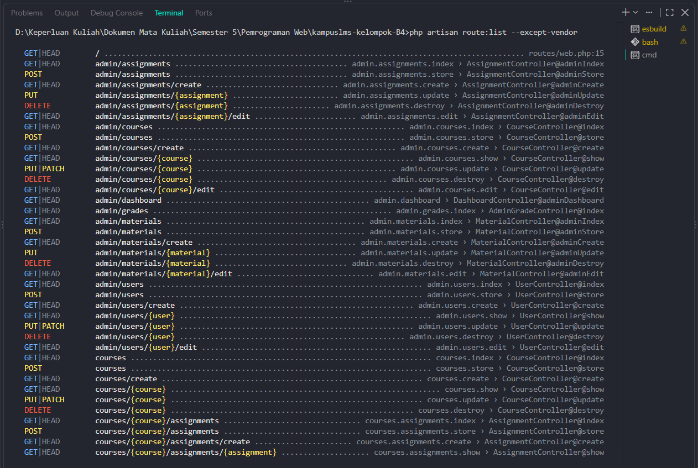
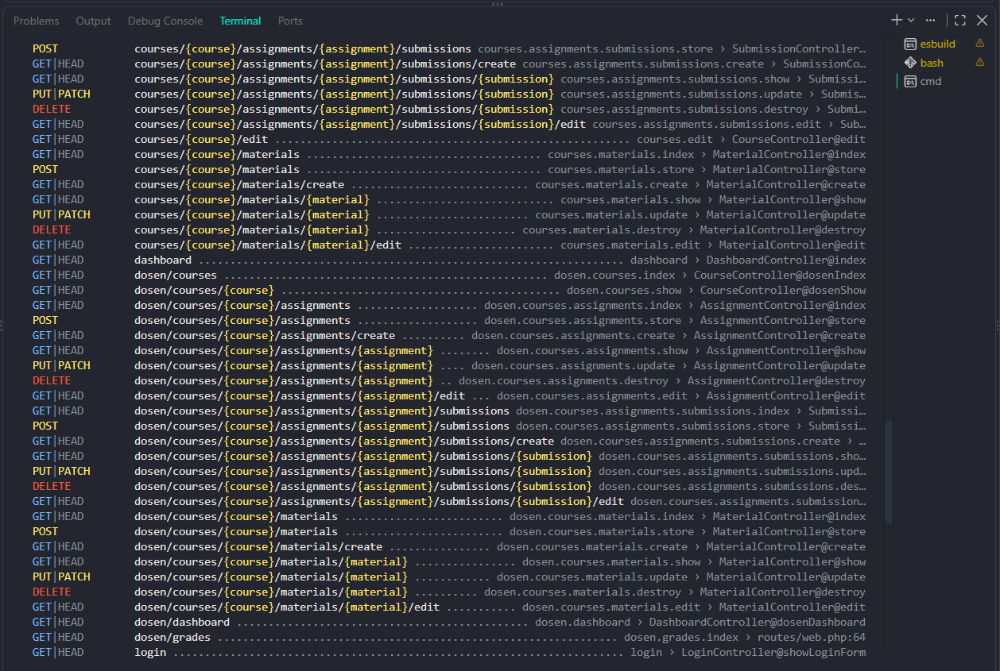

# Read Week 5 – Pemrograman Web

**Nama:** Laudya Aprilia Khoirum  
**NIM:** 10241038  
**Program Studi:** Sistem Informasi

## Jawaban

### 1–2. Route dan parameter model

Perintah `php artisan route:list --except-vendor` menampilkan **102 route**. Route berparameter model (parameter yang sama berlaku untuk aksi index/create/store/edit/update/delete resource):

- Admin: `/admin/users/{user}`, `/admin/courses/{course}`, `/admin/materials/{material}`, `/admin/assignments/{assignment}`.
- Dosen: `/dosen/courses/{course}` serta route turunannya dengan `{material}`, `{assignment}`, dan `{submission}`.
- Mahasiswa: `/mahasiswa/courses/{course}`, `/assignments/{assignment}`, dan route submission.
- Route umum: `/users/{user}`, `/courses/{course}` serta turunannya dengan `{material}`, `{assignment}`, dan `{submission}`.

### 3–4. Daftar Titik Rawan IDOR

| Route/parameter                                | Yang seharusnya boleh mengakses                | Perlindungan saat ini / risiko                                                                                                                         |
| ---------------------------------------------- | ---------------------------------------------- | ------------------------------------------------------------------------------------------------------------------------------------------------------ |
| `/admin/.../{user,course,material,assignment}` | Admin                                          | Prefix `admin` belum diberi middleware/otorisasi; berisiko diakses role lain.                                                                          |
| `/dosen/courses/{course}/...`                  | Dosen pengampu course                          | `scopeBindings()` mencocokkan relasi child-parent, tetapi tidak memastikan dosen adalah pengampu.                                                      |
| `/mahasiswa/courses/{course}/...`              | Mahasiswa yang terdaftar di course             | Belum ada pemeriksaan pendaftaran/role. Daftar submission juga belum difilter ke milik mahasiswa.                                                      |
| `/courses/...` dan `/users/{user}`             | Pengguna sesuai role dan kepemilikan data      | Route umum tidak memiliki middleware otorisasi; parameter ID dapat dicoba langsung.                                                                    |
| Route submission `{submission}`                | Pemilik submission, admin, atau dosen pengampu | `show`, `edit`, `update`, dan `destroy` memeriksa akses. `scopeBindings()` juga membatasi relasi; route lainnya belum memiliki perlindungan konsisten. |

**Kesimpulan:** `scopeBindings()` membatasi kecocokan relasi, bukan hak akses. Sebagian besar route berparameter masih rawan IDOR karena belum ada middleware atau pemeriksaan kepemilikan/role yang konsisten.