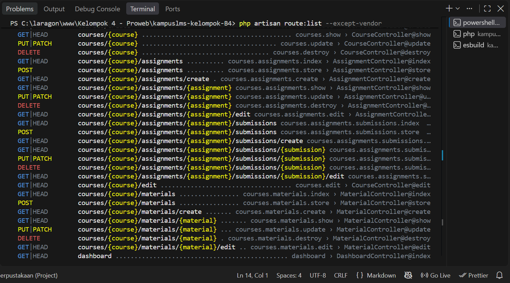

#  5.3 Read → Break → Fix → Build
#### Nama : Marchelino Senduk Kaunang
#### NIM : 10241040

#### 5.3 Read 

1. Jalankan `php artisan route:list --except-vendor`. Salin keluarannya ke catatan.
2. Tandai setiap route yang menerima parameter model (`{course}`, `{assignment}`, dst).
3. Untuk setiap route bertanda, jawab: **siapa saja yang seharusnya boleh mengaksesnya, dan apa yang saat ini mencegah orang lain?** Kemungkinan besar jawabannya "belum ada apa-apa" — itu wajar, dan itulah pekerjaan minggu ini dan minggu 7.
4. Buat tabel di `docs/minggu-05-<nama>.md` berjudul "Daftar Titik Rawan IDOR". Tabel ini akan Anda pakai lagi di minggu 7 dan saat interview.

Jawab :



Pemetaan route dilakukan menggunakan perintah:

```bash
php artisan route:list --except-vendor
```

Dari hasil `route:list`, ditemukan beberapa route yang menerima parameter model seperti `{course}`, `{assignment}`, `{submission}`, dan `{material}`. Route yang menggunakan parameter model perlu diperiksa karena pengguna dapat mencoba mengubah nilai parameter pada URL untuk mengakses objek lain.

## Daftar Titik Rawan IDOR

| No | Method | URI | Parameter Model | Seharusnya Boleh Diakses Oleh | Yang Saat Ini Mencegah Akses Orang Lain? |
|---:|---|---|---|---|---|
| 1 | GET/HEAD | `courses/{course}` | `course` | Pengguna yang memiliki akses ke course | Belum ada pemeriksaan authorization khusus |
| 2 | PUT/PATCH | `courses/{course}` | `course` | Admin atau pengguna yang diberi hak mengubah course | Belum ada pemeriksaan authorization khusus |
| 3 | DELETE | `courses/{course}` | `course` | Admin atau pengguna yang diberi hak menghapus course | Belum ada pemeriksaan authorization khusus |
| 4 | GET/HEAD | `courses/{course}/assignments` | `course` | Pengguna yang memiliki akses ke course | Belum ada pemeriksaan authorization khusus |
| 5 | POST | `courses/{course}/assignments` | `course` | Dosen yang berwenang pada course tersebut | Belum ada pemeriksaan authorization khusus |
| 6 | GET/HEAD | `courses/{course}/assignments/create` | `course` | Dosen yang berwenang pada course tersebut | Belum ada pemeriksaan authorization khusus |
| 7 | GET/HEAD | `courses/{course}/assignments/{assignment}` | `course`, `assignment` | Pengguna yang memiliki akses ke course dan assignment | Belum ada pemeriksaan authorization khusus |
| 8 | PUT/PATCH | `courses/{course}/assignments/{assignment}` | `course`, `assignment` | Dosen yang berwenang pada assignment tersebut | Belum ada pemeriksaan authorization khusus |
| 9 | DELETE | `courses/{course}/assignments/{assignment}` | `course`, `assignment` | Dosen yang berwenang pada assignment tersebut | Belum ada pemeriksaan authorization khusus |
| 10 | GET/HEAD | `courses/{course}/assignments/{assignment}/edit` | `course`, `assignment` | Dosen yang berwenang pada assignment tersebut | Belum ada pemeriksaan authorization khusus |
| 11 | GET/HEAD | `courses/{course}/assignments/{assignment}/submissions` | `course`, `assignment` | Dosen yang berwenang untuk melihat submission | Belum ada pemeriksaan authorization khusus |
| 12 | POST | `courses/{course}/assignments/{assignment}/submissions` | `course`, `assignment` | Mahasiswa yang terdaftar dan berhak mengumpulkan tugas | Belum ada pemeriksaan authorization khusus |
| 13 | GET/HEAD | `courses/{course}/assignments/{assignment}/submissions/create` | `course`, `assignment` | Mahasiswa yang berhak mengerjakan assignment | Belum ada pemeriksaan authorization khusus |
| 14 | GET/HEAD | `courses/{course}/assignments/{assignment}/submissions/{submission}` | `course`, `assignment`, `submission` | Pemilik submission dan/atau dosen yang berwenang | Belum ada pemeriksaan kepemilikan/authorization khusus |
| 15 | PUT/PATCH | `courses/{course}/assignments/{assignment}/submissions/{submission}` | `course`, `assignment`, `submission` | Pemilik submission atau pihak yang berwenang | Belum ada pemeriksaan kepemilikan/authorization khusus |
| 16 | DELETE | `courses/{course}/assignments/{assignment}/submissions/{submission}` | `course`, `assignment`, `submission` | Pemilik submission atau pihak yang berwenang | Belum ada pemeriksaan kepemilikan/authorization khusus |
| 17 | GET/HEAD | `courses/{course}/assignments/{assignment}/submissions/{submission}/edit` | `course`, `assignment`, `submission` | Pemilik submission atau pihak yang berwenang | Belum ada pemeriksaan kepemilikan/authorization khusus |
| 18 | GET/HEAD | `courses/{course}/edit` | `course` | Admin atau pengguna yang berwenang mengedit course | Belum ada pemeriksaan authorization khusus |
| 19 | GET/HEAD | `courses/{course}/materials` | `course` | Pengguna yang memiliki akses ke course | Belum ada pemeriksaan authorization khusus |
| 20 | POST | `courses/{course}/materials` | `course` | Dosen yang berwenang pada course tersebut | Belum ada pemeriksaan authorization khusus |
| 21 | GET/HEAD | `courses/{course}/materials/create` | `course` | Dosen yang berwenang pada course tersebut | Belum ada pemeriksaan authorization khusus |
| 22 | GET/HEAD | `courses/{course}/materials/{material}` | `course`, `material` | Pengguna yang memiliki akses ke course dan material | Belum ada pemeriksaan authorization khusus |
| 23 | PUT/PATCH | `courses/{course}/materials/{material}` | `course`, `material` | Dosen yang berwenang pada material tersebut | Belum ada pemeriksaan authorization khusus |
| 24 | DELETE | `courses/{course}/materials/{material}` | `course`, `material` | Dosen yang berwenang pada material tersebut | Belum ada pemeriksaan authorization khusus |
| 25 | GET/HEAD | `courses/{course}/materials/{material}/edit` | `course`, `material` | Dosen yang berwenang pada material tersebut | Belum ada pemeriksaan authorization khusus |

Berdasarkan hasil `php artisan route:list --except-vendor`, terdapat route yang menggunakan parameter `{course}`, `{assignment}`, `{submission}`, dan `{material}`.

Route-route tersebut menjadi titik yang perlu diperiksa terhadap kemungkinan IDOR karena pengguna dapat mencoba mengubah ID atau parameter pada URL. Pada tahap ini, sebagian besar route tersebut belum memiliki pemeriksaan authorization khusus. Daftar ini akan digunakan kembali pada minggu 7 untuk menentukan dan menerapkan Policy serta authorization sesuai dengan role dan kepemilikan data.

Pemetaan ini juga membantu mengetahui siapa yang seharusnya dapat mengakses setiap objek dan bagian mana yang masih membutuhkan perlindungan.


