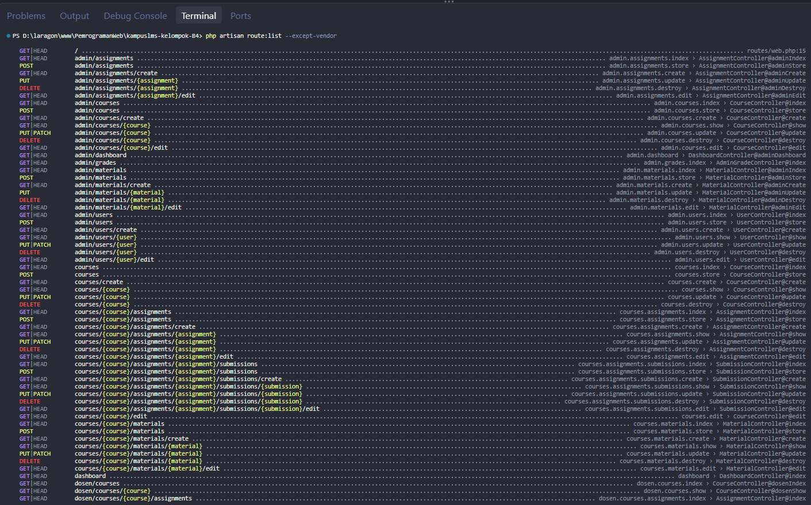

# Read Week 5 – Pemrograman Web

**Nama:** Moh Irsyad Fiqi Ferdiansyah Difa Nanda
**NIM:** 10241042  
**Program Studi:** Sistem Informasi

1. Jalankan `php artisan route:list --except-vendor`. Salin keluarannya ke catatan.
2. Tandai setiap route yang menerima parameter model (`{course}`, `{assignment}`, dst).
3. Untuk setiap route bertanda, jawab: **siapa saja yang seharusnya boleh mengaksesnya, dan apa yang saat ini mencegah orang lain?** Kemungkinan besar jawabannya "belum ada apa-apa" — itu wajar, dan itulah pekerjaan minggu ini dan minggu 7.
4. Buat tabel di `docs/minggu-05-<nama>.md` berjudul "Daftar Titik Rawan IDOR". Tabel ini akan Anda pakai lagi di minggu 7 dan saat interview.

Jawab :

### 1–2. Route dan parameter model

Perintah `php artisan route:list --except-vendor` menampilkan **102 route**. Route berparameter model (parameter yang sama berlaku untuk aksi index/create/store/edit/update/delete resource):

- Admin: `/admin/users/{user}`, `/admin/courses/{course}`, `/admin/materials/{material}`, `/admin/assignments/{assignment}`.
- Dosen: `/dosen/courses/{course}` serta route turunannya dengan `{material}`, `{assignment}`, dan `{submission}`.
- Mahasiswa: `/mahasiswa/courses/{course}`, `/assignments/{assignment}`, dan route submission.
- Route umum: `/users/{user}`, `/courses/{course}` serta turunannya dengan `{material}`, `{assignment}`, dan `{submission}`.

### 3. Hak akses dan perlindungan saat ini

- Route `/admin/.../{user,course,material,assignment}` seharusnya hanya dapat dikelola admin. Saat ini, prefix `admin` hanya mengelompokkan URL dan nama route; tidak ada middleware role pada grup ini, dan controller terkait tidak memeriksa bahwa pengguna adalah admin. Jadi, belum ada perlindungan akses yang memadai.
- Route `/dosen/courses/{course}/...` seharusnya hanya dapat diakses dosen pengampu course tersebut. `scopeBindings()` memastikan material, assignment, atau submission berada di course/assignment pada URL, tetapi tidak memastikan pengguna adalah dosen pengampunya. Belum ada middleware role atau pemeriksaan kepemilikan course.
- Route `/mahasiswa/courses/{course}/...` seharusnya hanya dapat diakses mahasiswa yang terdaftar pada course. Grup ini belum memeriksa role maupun pendaftaran. Halaman daftar submission memang memfilter data berdasarkan ID mahasiswa yang sedang login, tetapi halaman course, materi, tugas, dan form pengumpulan belum memiliki pemeriksaan akses serupa.
- Route umum `/users/{user}` seharusnya hanya untuk admin; `/courses/...` seharusnya dibatasi sesuai tindakan dan peran pengguna. Route umum tersebut tidak memiliki middleware role. Pada resource submission, `show`, `edit`, `update`, dan `destroy` sudah memeriksa pemilik submission, admin, atau dosen pengampu; `scopeBindings()` juga mencocokkan submission dengan course dan assignment. Namun `index`, `create`, dan `store` belum memiliki pemeriksaan akses yang setara.

### 4. Daftar Titik Rawan IDOR

| Route/parameter | Akses yang seharusnya | Titik rawan dan perlindungan saat ini |
| --- | --- | --- |
| `/admin/users/{user}`, `/admin/courses/{course}`, `/admin/materials/{material}`, `/admin/assignments/{assignment}` | Admin | ID dapat digunakan untuk melihat atau mengubah data tanpa pemeriksaan role pada route/controller. |
| `/dosen/courses/{course}/.../{material,assignment,submission}` | Dosen pengampu course | `scopeBindings()` hanya mencocokkan relasi antar-model; dosen yang bukan pengampu belum ditolak. |
| `/mahasiswa/courses/{course}/.../{assignment}` | Mahasiswa terdaftar | Belum ada pemeriksaan role atau pendaftaran course; ID course/assignment lain dapat dicoba langsung. Daftar submission memfilter milik mahasiswa, tetapi form pengumpulan belum memeriksa akses course. |
| `/users/{user}` dan `/courses/{course}` | Admin untuk data pengguna; akses course sesuai peran | Route umum tidak memiliki middleware role atau pemeriksaan kepemilikan yang konsisten. |
| `/courses/{course}/assignments/{assignment}/submissions/{submission}` | Pemilik submission, admin, atau dosen pengampu | `show`, `edit`, `update`, dan `destroy` sudah memeriksa akses serta route bertingkat memakai `scopeBindings()`. Aksi `index`, `create`, dan `store` belum memiliki pemeriksaan setara. |

**Catatan:** `scopeBindings()` mencegah penggunaan ID child yang tidak terkait dengan parent pada URL, tetapi tidak membuktikan bahwa pengguna berhak mengakses parent tersebut. Karena itu, pengecekan role, kepemilikan, atau pendaftaran tetap diperlukan.